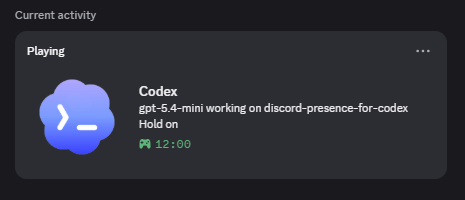
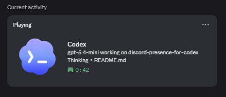
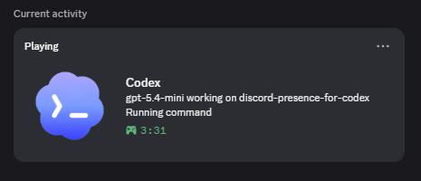
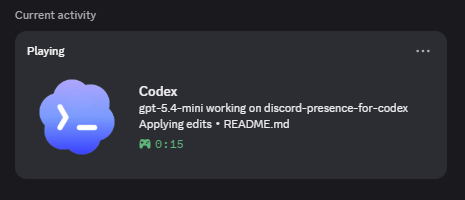
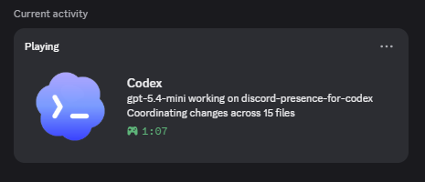

# Discord Presence for Codex

Discord Rich Presence for showing Codex as the active worker instead of the user's current tab or editor state.

Presence text is template-driven through `appsettings.json`, so you can change the copy without touching code.

## Quick Start

1. Run `build.cmd`.
2. Run `start.cmd`.
3. Run `stop.cmd` to shut it down.

The app is configured as a self-contained `win-x64` single-file publish.

## Preview

<table style="margin: 0 auto;">
  <tr>
    <td></td>
    <td></td>
  </tr>
  <tr>
    <td></td>
    <td></td>
  </tr>
</table>

<table style="margin: 0 auto;">
  <tr>
    <td></td>
  </tr>
</table>

## What It Shows

- Current Codex model when available
- Project name and project size
- Recent edited file name
- Git changed-file count
- Session elapsed time
- Token count placeholder
- Freshness text on the state line that updates in 3-second steps
- Discord buttons

## Activity Labels

The presence engine prefers observable, high-confidence labels first:

- `Running command`
- `Coordinating changes across {n} files`
- `Applying edits`
- `Creating files`
- `Deleting files`
- `Thinking`
- `Hold on`
- `Idling`

`Planning` and `Refactoring` are still supported, but they are treated as low-confidence labels and only appear when local evidence is explicit enough.

For quiet idle periods, the app shows `Hold on` for the first 5 minutes, then switches to `Idling`.

## Default Presence

- `Details`: `{ModelName} &bull; {Tokens}`
- `State`: `{ActivityLine}`
- `LargeImageText`: `working on {ProjectName}`
- `SmallImageText`: `{ProjectFileCount} files &bull; session {SessionElapsed}`
- Button: `GitHub`

`ActivityLine` carries the 3-second freshness suffix for `Thinking` only.
That timer is anchored to the start of the current thinking streak so it does not jump back to `0s` just because a new observation arrived.
When the same thinking state is observed again after new Codex activity, it can render as `Thinking x2`, `Thinking x3`, and so on.
Use `{ActivityLabel}` if you want the file name omitted for a cleaner one-line status.
Use `{GoalModePrefix}` if you want `Plan mode:` to appear without changing the main state line.
`goalmode` is normalized to `plan`, so both values render the same plan label.
During active implementation work, it can switch to `Code mode:` so planning and coding are visually distinct.
It stays blank for normal operation and for any other collaboration mode values.

## Model Detection

When `Presence.AutoDetectModelName` is enabled, the app resolves `{ModelName}` from:

- `CODEX_MODEL`, `OPENAI_MODEL`, or `MODEL_NAME`
- Recent Codex session JSONL files under `CODEX_HOME` or `%USERPROFILE%\.codex`
- `%USERPROFILE%\.codex\config.toml`
- `Presence.ModelName` as the fallback

The app logs these values for debugging:

- Selected UI model
- Last used session model
- Final displayed model

## Logging

The activity logger includes:

- the chosen activity label
- `confidence=high` or `confidence=low`
- the reason the label was selected

That makes it easier to verify why Discord is showing a specific state.

## Configuration

Common settings live in `appsettings.json`:

- `Discord.ClientId`
- `Discord.LargeImageKey`
- `Discord.SmallImageKey`
- `Project.Path`
- `Project.DisplayName`
- `Project.PreferGitRootForProjectPath`
- `Project.RecentFileSearchDepth`
- `Project.MaxRecentEditedFilesToTrack`
- `Project.MaxProjectFilesToScan`
- `Project.MaxLineCountFileBytes`
- `Project.IgnoredFilePatterns`
- `Project.IgnoredDirectories`
- `Presence.ModelName`
- `Presence.AutoDetectModelName`
- `Presence.Details`
- `Presence.State`
- `Presence.LargeImageText`
- `Presence.SmallImageText`
- `Presence.Buttons`
- `Presence.AnalyzingProjectText`
- `Presence.UpdatingFilesText`
- `Presence.CreatingFilesText`
- `Presence.DeletingFilesText`
- `Presence.RunningCommandText`
- `Presence.PlanningText`
- `Presence.ApplyingEditsText`
- `Presence.RefactoringText`
- `Presence.ThinkingText`
- `Presence.IdlingText`
- `Presence.ReadyText`
- `Presence.ThinkingStaleTimeoutMinutes`
- `Presence.ReadyIdleGraceMinutes`
- `Presence.EditingFreshnessSeconds`
- `Presence.FreshnessUpdateIntervalSeconds`
- `Presence.ActiveUpdateIntervalSeconds`
- `Presence.RunningCommandUpdateIntervalSeconds`
- `Presence.RunningCommandHoldSeconds`
- `Presence.IdleUpdateIntervalSeconds`
- `UpdateIntervalSeconds`

## Template Values

These placeholders can be used in `Presence.Details`, `Presence.State`, `Presence.LargeImageText`, `Presence.SmallImageText`, and button labels/URLs:

- `{ModelName}`
- `{CodexStatus}`
- `{CodexProcessName}`
- `{ProjectName}`
- `{ProjectPath}`
- `{ProjectFileCount}`
- `{ProjectLineCount}`
- `{ProjectSizeText}`
- `{GoalModePrefix}`
- `{EditingFileName}`
- `{EditingFileLabel}`
- `{EditingFilePath}`
- `{ActiveEditedFileCount}`
- `{ActiveEditedFilesText}`
- `{ChangedFileCount}`
- `{ChangedFilesText}`
- `{ActivityLabel}`
- `{ActivityKind}`
- `{ActivityConfidence}`
- `{ActivityProvenance}`
- `{ActivityReason}`
- `{ActivityLine}`
- `{SessionElapsed}`
- `{SessionStartedAt}`
- `{FreshnessElapsed}`
- `{Tokens}`
- `{Cost}`

## Discord App

The default Discord application id is:

`1516846793873424474`

The default large image key is:

`codex_logo`

## Notes

- `start.cmd` launches the published exe in the background
- `stop.cmd` stops the running instance
- `git diff`, recent file writes, and session logs are used together to infer active work
- Project scanning ignores common build, cache, and binary folders
- Activity and evidence helpers live under `Modules/` to keep the main entrypoints smaller
- The default refresh cadence is shortened so activity changes surface faster in Discord

