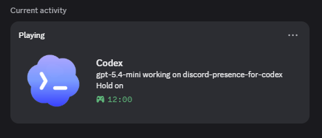
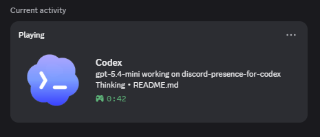
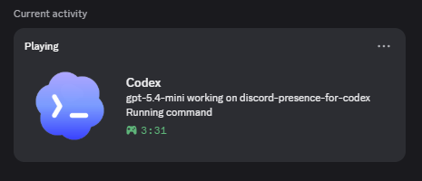
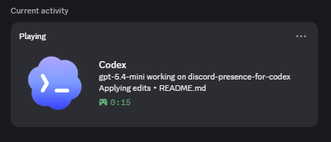
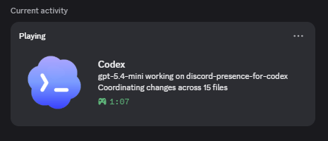

# Discord Presence for Codex

Discord Rich Presence for showing Codex as the active worker instead of the user's current tab or editor state.

Presence text is template-driven through `appsettings.json`, so you can change the copy without touching code.

## Quick Start

1. Run `build.cmd`.
2. Run `start.cmd`.
3. Run `stop.cmd` to shut it down.
4. Run `install.cmd` to create desktop and Start Menu shortcuts.
5. Run `install.cmd --autostart` to also register Windows startup.
6. Run `uninstall.cmd` to remove created shortcuts.

The app is configured as a `win-x64` single-file publish that requires the .NET 9 Desktop Runtime on the target machine.
It runs in the background with a system tray icon, where you can toggle `Enable`, open `appsettings.json`, or `Quit`.
`start.cmd` stops the previous process, waits for it to exit, rebuilds, and launches the latest published build so the tray app stays in sync with the current source.
The tray `Enable` state is saved under `%LOCALAPPDATA%\CodexDiscordPresence\presence-state.json`.
The app can also check GitHub Releases once at startup and only logs when a newer release exists.

## Preview

<table style="margin: 0 auto;">
  <tr>
    <td></td>
    <td></td>
  </tr>
  <tr>
    <td></td>
    <td></td>
  </tr>
</table>

<table style="margin: 0 auto;">
  <tr>
    <td></td>
  </tr>
</table>

## What It Shows

- Current Codex model, reasoning effort, and effective Fast mode speed when available
- Project name and project size
- Recent edited file name
- Git changed-file count
- Session elapsed time
- Token count placeholder
- Discord buttons

## Activity Labels

The presence engine prefers observable, high-confidence labels first:

- `Run Command`
- `Run Command: git`
- `Run Command: Get-ChildItem`
- `Run Command: dotnet`
- `Run Command: rg`
- `Coordinating changes across {n} files`
- `Applying edits`
- `Creating files`
- `Deleting files`
- `Investigating`
- `Working`
- `Waiting`
- `Idling`

`Planning` and `Refactoring` are still supported, but they are treated as low-confidence labels and only appear when local evidence is explicit enough.
`Working` is only emitted when there is explicit `task_started` evidence in the session log, so it stays stronger than the short idle grace labels.
`Investigating` remains the fallback for ambiguous exploration. More specific shell-command evidence now renders as `Run Command: git`, `Run Command: Get-ChildItem`, `Run Command: dotnet`, or `Run Command: rg` before falling back to the generic analysis label.

For quiet idle periods, the app shows `Waiting` for the first 5 minutes, then switches to `Idling`.

## Default Presence

- `Details`: `{ModelName} &bull; {Tokens}`
- `State`: `{ActivityLine}`
- `LargeImageText`: `{ProjectName}`
- `SmallImageText`: `{ProjectFileCount} files &bull; session {SessionElapsed}`
- Button: `GitHub`

When the same thinking state is observed again after new Codex activity, it can render as `Thinking x2`, `Thinking x3`, and so on.
Use `{ActivityLabel}` if you want the file name omitted for a cleaner one-line status.
Use `{GoalModePrefix}` if you want `Plan mode:` to appear without changing the main state line.
`goalmode` is normalized to `plan`, so both values render the same plan label.
During active implementation work, it can switch to `Code mode:` so planning and coding are visually distinct.
It stays blank for normal operation and for any other collaboration mode values.

## Model Detection

When `Presence.AutoDetectModelName` is enabled, the app resolves `{ModelName}` from:

- `CODEX_MODEL`, `OPENAI_MODEL`, or `MODEL_NAME`
- Recent Codex session JSONL files under `CODEX_HOME` or `%USERPROFILE%\.codex`
- `%USERPROFILE%\.codex\config.toml`
- `Presence.ModelName` as the fallback

The displayed `{ModelName}` keeps the raw model available for token-cost lookup, while formatting GPT model slugs with spaces for Discord. For example, `gpt-5.6-luna` becomes `gpt 5.6 luna`, and a detected reasoning effort is appended as `gpt 5.6 luna max`.

For GPT-5.6, GPT-5.5, and GPT-5.4, the display appends `1.5x` only when the latest project-matching session reports an effective `service_tier` of `priority` or `fast`. `default`, a missing session value, and config-only Fast mode settings omit the speed suffix; the literal word `fast` is never displayed.

Examples:

- `gpt 5.6 luna max &bull; 12.4K Token`
- `gpt 5.6 luna max 1.5x &bull; 12.4K Token`

Token usage is only read from sessions whose `cwd` exactly matches the active project path. If no exact match exists, token usage stays empty instead of borrowing another project's totals.

The app logs these values for debugging:

- Selected UI model
- Last used session model
- Selected reasoning effort
- Effective service tier
- Final displayed model

## Logging

The activity logger includes:

- the chosen activity label
- `confidence=high` or `confidence=low`
- the reason the label was selected
- recent edited file labels are kept until the project changes so the state line does not flicker between empty and populated

That makes it easier to verify why Discord is showing a specific state.

## Configuration

Common settings live in `appsettings.json`:

- `Discord.ClientId`
- `Discord.LargeImageKey`
- `Discord.SmallImageKey`
- `Discord.ActivityImageKeys`
- `Discord.RunningCommandImageKeys`
- `Discord.ExternalImageUrls`
- `Project.Path`
- `Project.DisplayName`
- `Project.PreferGitRootForProjectPath`
- `Project.RecentFileSearchDepth`
- `Project.MaxRecentEditedFilesToTrack`
- `Project.MaxProjectFilesToScan`
- `Project.MaxLineCountFileBytes`
- `Project.IgnoredFilePatterns`
- `Project.IgnoredDirectories`
- `Presence.ModelName`
- `Presence.AutoDetectModelName`
- `Presence.Details`
- `Presence.State`
- `Presence.EnableLargeImageText`
- `Presence.LargeImageText`
- `Presence.SmallImageText`
- `Presence.Buttons`
- `Presence.AnalyzingProjectText`
- `Presence.CoordinatingChangesText`
- `Presence.CreatingFilesText`
- `Presence.DeletingFilesText`
- `Presence.RunningCommandText`
- `Presence.PlanningText`
- `Presence.ApplyingEditsText`
- `Presence.RefactoringText`
- `Presence.ThinkingText`
- `Presence.WorkingText`
- `Presence.InvestigatingText`
- `Presence.WaitingText`
- `Presence.IdlingText`
- `Presence.ReadyText`
- `Presence.WaitingActivityText`
- `Presence.ThinkingStaleTimeoutMinutes`
- `Presence.ReadyIdleGraceMinutes`
- `Presence.EditingFreshnessSeconds`
- `Presence.ActiveUpdateIntervalSeconds`
- `Presence.RunningCommandUpdateIntervalSeconds`
- `Presence.RunningCommandHoldSeconds`
- `Presence.IdleUpdateIntervalSeconds`
- `EnableUpdateCheck`
- `UpdateIntervalSeconds`

## Template Values

These placeholders can be used in `Presence.Details`, `Presence.State`, `Presence.LargeImageText`, `Presence.SmallImageText`, and button labels/URLs:

`{ModelName}` resolves to the formatted Discord label described in [Model Detection](#model-detection).

- `{ModelName}`
- `{CodexStatus}`
- `{CodexProcessName}`
- `{ProjectName}`
- `{ProjectPath}`
- `{ProjectFileCount}`
- `{ProjectLineCount}`
- `{ProjectSizeText}`
- `{GoalModePrefix}`
- `{EditingFileName}`
- `{EditingFileLabel}`
- `{EditingFilePath}`
- `{ActiveEditedFileCount}`
- `{ActiveEditedFilesText}`
- `{ChangedFileCount}`
- `{ChangedFilesText}`
- `{ActivityLabel}`
- `{ActivityKind}`
- `{ActivityConfidence}`
- `{ActivityProvenance}`
- `{ActivityReason}`
- `{ActivityLine}`
- `{RunningCommandName}`
- `{RunningCommandKind}`
- `{SessionElapsed}`
- `{SessionStartedAt}`
- `{Tokens}`
- `{Cost}`

Set `Presence.EnableLargeImageText` to `false` if you want Discord to show only the large image without the hover text under it.

## Discord Art Assets

The RPC art pack is stored in `Assets/RpcArt`. The source GIFs remain unchanged. The Discord application's Rich Presence art assets retain static fallbacks under the same internal keys, while `Discord.ExternalImageUrls` points the runtime presence at the original public images.

The application uses these internal keys:

- `rpc_codex`: fixed small image
- `rpc_thinking`: analysis and planning
- `rpc_coding`: edits, file creation/deletion, and refactoring
- `rpc_sleeping`: offline and ready/idle states
- `rpc_reading`: Git commands
- `rpc_searching`: search commands
- `rpc_building`: build and unknown commands
- `rpc_debugging`: test commands
- `rpc_deploying`, `rpc_success`, `rpc_error`: uploaded keys reserved for future event-specific states

Discord's Developer Portal currently accepts PNG, JPEG, and WebP for uploaded Rich Presence assets, and uploaded animations are not supported. For GIF-backed keys, the runtime therefore sends the configured external GIF URL; if a URL is missing or invalid, it falls back to the internal portal key.

## Discord App

The default Discord application id is:

`1516846793873424474`

The default large image key is:

`rpc_thinking`

The default small image key is:

`rpc_codex`

## Notes

- `start.cmd` stops the previous process, rebuilds, and launches the latest published exe in the background
- `stop.cmd` stops the running instance
- Install the .NET 9 Desktop Runtime if the app says the runtime is missing
- `git diff`, recent file writes, and session logs are used together to infer active work
- Project scanning ignores common build, cache, and binary folders
- Activity and evidence helpers live under `Modules/` to keep the main entrypoints smaller
- The app re-checks the active project at most every 3 seconds so project switches surface quickly
- The default refresh cadence is shortened so activity changes surface faster in Discord

