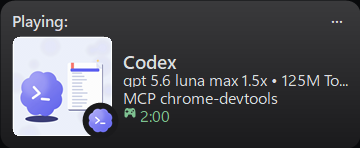

# Codex Discord Rich Presence for Windows

An unofficial Windows tray application that shows the current Codex CLI or Codex Desktop activity in Discord Rich Presence. It resolves observable session events, model and reasoning metadata, project/Git context, edited files, and current MCP activity into one readable Discord activity line.

This project is not affiliated with or endorsed by OpenAI or Discord. It does not provide a cloud account or hosted backend; it runs locally and publishes the selected activity through Discord's local RPC connection.

## Download

Download the latest Windows x64 executable from [GitHub Releases](https://github.com/k153636/codex-discord-presence/releases/latest):

`discord-presence-for-codex.exe`

The current published build requires the .NET 9 Desktop Runtime. Discord Desktop must be running for Rich Presence to be published.

For the user-facing documentation, see the [Codex Discord Rich Presence site](https://k153636.github.io/codex-discord-presence/), [FAQ](https://k153636.github.io/codex-discord-presence/faq.html), and [compatibility notes](https://k153636.github.io/codex-discord-presence/compatibility.html).

## Build from source

1. Run `build.cmd`.
2. Run `start.cmd`.
3. Run `stop.cmd` to shut it down.
4. Run `install.cmd` to create desktop and Start Menu shortcuts and install the PowerShell `codex-rpc` command.
5. Open a new PowerShell session, then run `codex-rpc` from any directory.
6. Run `install.cmd --autostart` to also register Windows startup.
7. Run `uninstall.cmd` to remove the created shortcuts and `codex-rpc` command.

The app is configured as a `win-x64` single-file publish that requires the .NET 9 Desktop Runtime on the target machine.
It runs in the background with a system tray icon, where you can toggle `Enable`, open `appsettings.json`, or `Quit`.
`start.cmd` stops the previous process, waits for it to exit, rebuilds, and launches the latest published build so the tray app stays in sync with the current source.
The installed `codex-rpc` command opens the existing `publish\discord-presence-for-codex.exe` without rebuilding. Run `build.cmd` explicitly when source changes should be included; if no published build exists, `codex-rpc` exits with that instruction instead of invoking the SDK. After installation or removal, an already-open PowerShell session must be reopened to observe the PATH change.
The tray `Enable` state is saved under `%LOCALAPPDATA%\CodexDiscordPresence\presence-state.json`.
The app can also check GitHub Releases once at startup and only logs when a newer release exists.

## Current preview

This is a render from the same `DashboardPreviewSurface` used by the tray app. It is not an external RPC mockup. The showcase values come from a real party session in the local log:

`2026-09-06T13:10:04.6017402Z [INFO] Presence rendered: Details=gpt 5.6 luna max 1.5x • 125M Token; State=MCP chrome-devtools Reading; LargeImage=rpc_reading`

The corresponding activity-detection record reports `partySize=5`. The preview was rendered from a published-presence snapshot carrying that real `5 / 5` party value, while the visible state follows the current MCP display policy (`MCP chrome-devtools`, without the internal `Reading` suffix).

  

The preview uses Discord's current typography hierarchy: `gg sans` when it is installed, otherwise the available `Segoe UI Variable Text` family with a named Semibold face for headings. Discord states that `gg sans` is proprietary and not currently open source, so it is not bundled with this project.

## Archived preview images

The remaining `Preview/rpc-preview-1.png` through `Preview/rpc-preview-5.png` files are historical examples from an earlier build and may not match the current release output. They are retained as development references, not as current product screenshots.

<table style="margin: 0 auto;">
  <tr>
    <td></td>
    <td></td>
  </tr>
  <tr>
    <td></td>
    <td></td>
  </tr>
</table>

<table style="margin: 0 auto;">
  <tr>
    <td></td>
  </tr>
</table>

## What It Shows

- Current Codex model, reasoning effort, and effective Fast mode speed when available
- Project name and project size
- Recent edited file name
- Git changed-file count
- Session elapsed time
- Session token information when available
- Discord buttons

## Activity Labels

The presence engine prefers observable, high-confidence labels first:

- `Run Command`
- `Run Command: git`
- `Run Command: Get-ChildItem`
- `Run Command: dotnet`
- `Run Command: rg`
- `Researching`
- `Coordinating {n} files`
- `Editing FileName.cs`
- `Creating files`
- `Deleting files`
- `Working`
- `Waiting`
- `Idling`

`Planning` and `Refactoring` are still supported, but they are treated as low-confidence labels and only appear when local evidence is explicit enough.
When Codex emits a reasoning summary, the latest summary replaces `Working`, for example `Designing mobile-friendly file label format`.
`Working` remains the fallback when no usable summary is present. A pending web or research MCP tool call renders `Researching`; local shell search still renders as `Run Command: git`, `Run Command: Get-ChildItem`, or `Run Command: rg`.

For quiet idle periods, the app shows `Waiting` for the first 5 minutes, then switches to `Idling`.

## Default Presence

- `Details`: `{ModelName} &bull; {Tokens}`
- `State`: `{ActivityLine}`
- `LargeImageText`: `{ProjectName}`
- `SmallImageText`: `{ProjectFileCount} files &bull; session {SessionElapsed}`
- Button: `K's Codex RPC` → `https://github.com/k153636/codex-discord-presence`

When no usable reasoning summary is available, repeated generic analysis states can still render with an `x2`, `x3`, and so on repeat suffix.
Use `{ActivityLabel}` if you want the file name omitted for a cleaner one-line status.
Use `{ThinkingSummary}` to place the latest normalized reasoning summary directly in a custom template.
Use `{GoalModePrefix}` if you want `Plan mode:` to appear without changing the main state line.
`goalmode` is normalized to `plan`, so both values render the same plan label.
During active implementation work, it can switch to `Code mode:` so planning and coding are visually distinct.
It stays blank for normal operation and for any other collaboration mode values.

## Model Detection

When `Presence.AutoDetectModelName` is enabled, the app resolves `{ModelName}` from:

- `CODEX_MODEL`, `OPENAI_MODEL`, or `MODEL_NAME`
- Recent Codex session JSONL files under `CODEX_HOME` or `%USERPROFILE%\.codex`
- `%USERPROFILE%\.codex\config.toml`
- `Presence.ModelName` as the fallback

The displayed `{ModelName}` keeps the raw model available for token-cost lookup, while formatting GPT model slugs with spaces for Discord. For example, `gpt-5.6-luna` becomes `gpt 5.6 luna`, and a detected reasoning effort is appended as `gpt 5.6 luna max`.

For GPT-5.6, GPT-5.5, and GPT-5.4, the display appends `1.5x` only when the latest project-matching session reports an effective `service_tier` of `priority` or `fast`. `default`, a missing session value, and config-only Fast mode settings omit the speed suffix; the literal word `fast` is never displayed.

Examples:

- `gpt 5.6 luna max &bull; 12.4K Token`
- `gpt 5.6 luna max 1.5x &bull; 12.4K Token`

Token usage is only read from sessions whose `cwd` exactly matches the active project path. If no exact match exists, token usage stays empty instead of borrowing another project's totals.

The app logs these values for debugging:

- Selected UI model
- Last used session model
- Selected reasoning effort
- Effective service tier
- Final displayed model

## Logging

The activity logger includes:

- the chosen activity label
- `confidence=high` or `confidence=low`
- the reason the label was selected
- recent edited file labels are kept until the project changes so the state line does not flicker between empty and populated

That makes it easier to verify why Discord is showing a specific state.

## Release distribution

The GitHub Release contains only `discord-presence-for-codex.exe` for the normal desktop launch flow.
`appsettings.json` is an optional executable-directory override, and `appsettings.cli.json` is an optional separate CLI-profile override; both remain available in the repository for users who need to customize or run the CLI profile.
When they are absent, the executable uses the compiled defaults, including the `K's Codex RPC` repository button.
The published executable is framework-dependent, so the .NET 9 Desktop Runtime is still required on the target PC.

## Configuration

Common settings live in `appsettings.json`:

- `Discord.ClientId`
- `Discord.LargeImageKey`
- `Discord.SmallImageKey`
- `Discord.ActivityImageKeys`
- `Discord.RunningCommandImageKeys`
- `Discord.ExternalImageUrls`
- `Project.Path`
- `Project.DisplayName`
- `Project.PreferGitRootForProjectPath`
- `Project.RecentFileSearchDepth`
- `Project.MaxRecentEditedFilesToTrack`
- `Project.MaxProjectFilesToScan`
- `Project.MaxLineCountFileBytes`
- `Project.IgnoredFilePatterns`
- `Project.IgnoredDirectories`
- `Presence.ModelName`
- `Presence.AutoDetectModelName`
- `Presence.Details`
- `Presence.State`
- `Presence.EnableLargeImageText`
- `Presence.LargeImageText`
- `Presence.SmallImageText`
- `Presence.Buttons`
- `Presence.AnalyzingProjectText`
- `Presence.CoordinatingChangesText`
- `Presence.CreatingFilesText`
- `Presence.DeletingFilesText`
- `Presence.RunningCommandText`
- `Presence.PlanningText`
- `Presence.ApplyingEditsText`
- `Presence.RefactoringText`
- `Presence.ThinkingText`
- `Presence.WorkingText`
- `Presence.ResearchingText`
- `Presence.WaitingText`
- `Presence.IdlingText`
- `Presence.ReadyText`
- `Presence.WaitingActivityText`
- `Presence.ThinkingStaleTimeoutMinutes`
- `Presence.ReadyIdleGraceMinutes`
- `Presence.EditingFreshnessSeconds`
- `Presence.ActiveUpdateIntervalSeconds`
- `Presence.RunningCommandUpdateIntervalSeconds`
- `Presence.RunningCommandHoldSeconds`
- `Presence.IdleUpdateIntervalSeconds`
- `EnableUpdateCheck`
- `UpdateIntervalSeconds`

## Template Values

These placeholders can be used in `Presence.Details`, `Presence.State`, `Presence.LargeImageText`, `Presence.SmallImageText`, and button labels/URLs:

`{ModelName}` resolves to the formatted Discord label described in [Model Detection](#model-detection).

- `{ModelName}`
- `{CodexStatus}`
- `{CodexProcessName}`
- `{ProjectName}`
- `{ProjectPath}`
- `{ProjectFileCount}`
- `{ProjectLineCount}`
- `{ProjectSizeText}`
- `{GoalModePrefix}`
- `{EditingFileName}`
- `{EditingFileLabel}`
- `{EditingFilePath}`
- `{ActiveEditedFileCount}`
- `{ActiveEditedFilesText}`
- `{ChangedFileCount}`
- `{ChangedFilesText}`
- `{ActivityLabel}`
- `{ActivityKind}`
- `{ActivityConfidence}`
- `{ActivityProvenance}`
- `{ActivityReason}`
- `{ActivityLine}`
- `{ThinkingSummary}`
- `{RunningCommandName}`
- `{RunningCommandKind}`
- `{SessionElapsed}`
- `{SessionStartedAt}`
- `{Tokens}`
- `{Cost}`

Set `Presence.EnableLargeImageText` to `false` if you want Discord to show only the large image without the hover text under it.

## Discord Art Assets

The RPC art pack is stored in `Assets/RpcArt`. The remaining source GIFs stay
as GIFs. The retired building asset is no longer part of the pack. The Discord
application's Rich Presence art assets retain static fallbacks under the same
internal keys, while `Discord.ExternalImageUrls` points the runtime presence
at the original public images.

The application uses these internal keys:

- `rpc_codex`: fixed small image
- `rpc_thinking`: evidence-backed reasoning and planning only; concrete commands, MCP calls, edits, research, and unresolved operations use their own or the waiting mapping
- `rpc_coding`: edits, file creation/deletion, refactoring, and unclassified build/command activity
- `rpc_sleeping`: offline, waiting after the completion hold, and ready/idle states
- `rpc_reading`: Git commands
- `rpc_searching`: search commands
- `rpc_debugging`: test commands
- `rpc_success`: a freshly successful Codex turn (configured by `Discord.CompletedImageKey`)
- `rpc_error`: an explicitly failed Codex turn only (configured by `Discord.ErrorImageKey`)
- `rpc_deploying`: reserved for future event-specific states

`Stalled` means that observable activity stopped before a terminal result was
received; it is not treated as an error and therefore uses the neutral waiting
asset. `rpc_error` is selected only when the session contains a failed terminal
event such as `turn_failed`, `task_failed`, or a failed terminal status.

When Codex enters the semantic `Waiting` state after a successful turn, the
runtime uses `Discord.CompletedImageKey` for the first
`Discord.CompletedImageHoldSeconds` seconds (60 by default), then switches to
`rpc_sleeping`. The resolved image key is part of the dispatch signature, so
the one-minute transition is sent to Discord even when the text state is
unchanged. If a current active event cannot prove Thinking, the text state is
`Waiting` and the waiting asset mapping is used; the runtime no longer uses a
generic build-style fallback.

Discord's Developer Portal currently accepts PNG, JPEG, and WebP for uploaded Rich Presence assets, and uploaded animations are not supported. For GIF-backed keys, the runtime therefore sends the configured external GIF URL; if a URL is missing or invalid, it falls back to the internal portal key.

## Discord App

The default Discord application id is:

`1516846793873424474`

The default large image key is:

`rpc_thinking`

The default small image key is:

`rpc_codex`

## Notes

- `start.cmd` stops the previous process, rebuilds, and launches the latest published exe in the background
- `codex-rpc` stops the previous process and launches the latest existing published exe without rebuilding
- `stop.cmd` stops the running instance
- Install the .NET 9 Desktop Runtime if the app says the runtime is missing
- `git diff`, recent file writes, and session logs are used together to infer active work
- Project scanning ignores common build, cache, and binary folders
- Activity and evidence helpers live under `Modules/` to keep the main entrypoints smaller
- The app re-checks the active project at most every 3 seconds so project switches surface quickly
- The default refresh cadence is shortened so activity changes surface faster in Discord

